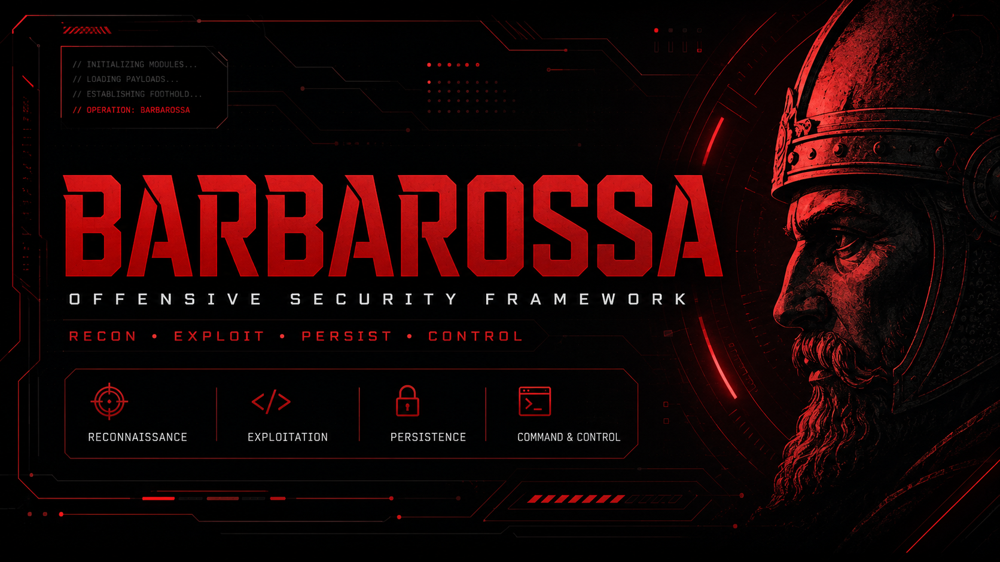

# BARBAROSSA



**BARBAROSSA** is a deterministic, non-destructive web application security inspection and authorized testing toolkit. It is designed for developers, security students, and defensive security professionals to identify vulnerabilities through both static analysis and active probing.

## Important Disclaimer

**Use BARBAROSSA only on systems you own or are explicitly authorized to test.**

Unauthorized security testing may be illegal. BARBAROSSA enforces strict authorization requirements by default to ensure ethical and legal use.

## Core Features

### Stage 1: Static Inspection (INSPECT)
Analyze source code for security vulnerabilities using deterministic rules:
* **Python**: AST-based analysis for dangerous coding patterns.
* **JavaScript/TypeScript**: Pattern-based code inspection.
* **Configuration Files**: Security checks for JSON, YAML, TOML, INI, .env, and Dockerfiles.
* **Secret Detection**: Identification of credentials, API keys, tokens, and private keys.
* **Vulnerability Patterns**: Detection of SQL injection indicators, unsafe deserialization, weak hashing, and CORS misconfigurations.

### Stage 2: Active Probes (PROBE)
Perform non-destructive HTTP security checks on authorized targets:
* **Transport Security**: Validation of TLS configuration and HTTPS enforcement.
* **Security Headers**: Verification of CSP, HSTS, X-Content-Type-Options, and other critical headers.
* **Session Management**: Inspection of cookie flags (Secure, HttpOnly, SameSite) and CSRF protection.
* **Input Reflection**: Safe testing for XSS and SQL injection indicators.
* **Environment Checks**: Detection of directory listing, exposed files, and verbose error messages.
* **Resource Respect**: Configurable rate-limiting (default: 2 req/sec) to prevent service disruption.

### Reporting
Generate comprehensive reports in multiple formats:
* **Console**: Real-time findings with structured output.
* **JSON**: Structured data for automated pipeline integration.
* **HTML**: Visual reports with charts and detailed findings.
* **SARIF**: GitHub-compatible security format for integration with GitHub Advanced Security.

### Educational Mode
A dedicated mode for security students that explains:
* The purpose and mechanism of each test.
* Expected results and common pitfalls.
* Remediation strategies and exercises.

## Security and Design Principles

* **Deterministic**: Relies on defined rules rather than probabilistic models.
* **Non-destructive**: Ensures no modifications are made to the target system.
* **Authorization-centric**: Requires explicit confirmation of scope and consent.
* **Safety-enforced**: Includes a strict allowlist and protection against DNS rebinding.
* **Emergency Halt**: Support for a `STOP_BARBAROSSA` trigger file to immediately terminate scans.

## Installation

### Requirements
* Python 3.12+
* pip or uv

### From Source
```bash
git clone https://github.com/PetiRu/Barbarossa.git
cd Barbarossa
pip install -e .
```

### Development Setup
```bash
pip install -e ".[dev]"
ruff check .
mypy barbarossa
pytest
```

## Usage and Commands

### Quick Start
1. **Static Inspection**:
   ```bash
   barbarossa inspect ./src
   ```
2. **Active Probes**:
   ```bash
   barbarossa probe http://localhost:8000 --authorized
   ```
3. **Full Scan**:
   ```bash
   barbarossa scan --source ./src --target http://localhost:8000 --authorized
   ```

### Command Reference
```bash
# Run static analysis only
barbarossa inspect [SOURCE_DIR]

# Run active HTTP probes only
barbarossa probe [TARGET_URL] --authorized

# Run full inspection and probes
barbarossa scan --source [DIR] --target [URL] --authorized

# Learning mode for educational purposes
barbarossa probe [URL] --learning-mode
```

### Help and Version
To see the full list of options and commands:
```bash
barbarossa --help
```
To check the installed version:
```bash
barbarossa --version
```

## Documentation
Detailed guides are available in the `docs/` directory:
* [Getting Started](docs/getting-started.md)
* [Authorization and Scope](docs/authorization-and-scope.md)
* [Static Inspection](docs/static-inspection.md)
* [Active Probes](docs/active-probes.md)
* [Reporting Formats](docs/reports.md)

## Limitations
BARBAROSSA is an inspection tool, not an exploitation framework. It does not perform:
* Automated exploitation or payload execution.
* Password brute-forcing or credential stuffing.
* Data exfiltration or Denial of Service (DoS) attacks.
* Authentication bypass or Remote Code Execution (RCE).

## Contributing
Contributions are welcome. Please refer to [CONTRIBUTING.md](CONTRIBUTING.md) for guidelines.

## License
Distributed under the MIT License. See `LICENSE` for more information.
